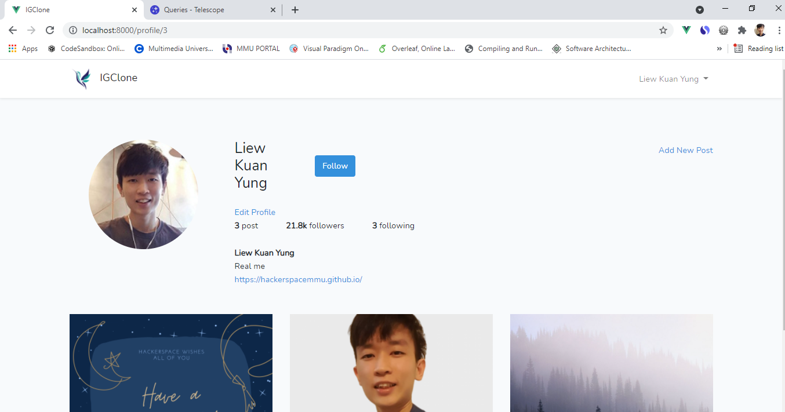

# About Laravel

Laravel is a web application framework with expressive, elegant syntax. We believe development must be an enjoyable and creative experience to be truly fulfilling. Laravel takes the pain out of development by easing common tasks used in many web projects.

## About This Project

This project is a follow along project from [freeCodeCamp](https://www.youtube.com/watch?v=ImtZ5yENzgE), creating an IG Clone. This project covers a Laravel's basics, and some intermediate knowledge i.e., artisan, cache, file storage, database, telescope, and most importantly Eloquent ORM. My learning path is recorded inside [RECORDS.md](./RECORDS.md), and some of the demo pictures are located inside [DEMO-Pict](./DEMO-Pict).